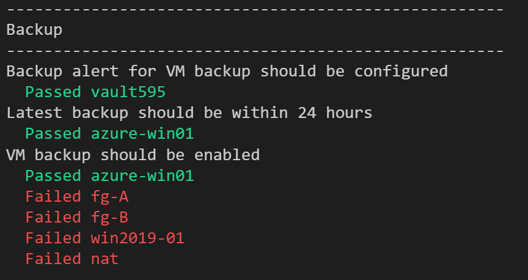

# Test-Azure

PowerShell script to validate Azure environment.

## Usage 

1. Open PowerShell
2. git clone https://github.com/kongou-ae/Test-Azure
3. Login Azure scription which you want to validate.
4. Validate your Azure
   1. ./Test-Azure.ps1 # Readable output
   2. ./Test-Azure.ps1 -json # JSON

## The points which are validated by this script

### Application Gateway

- Application Gateway should be v2
- Minimum instance should be greater equal two

### AppService

- App Service Plan should be greater equal Basic
- Sku for production should have grater equal two instances

### Compute

- Boot diag should be enabled
- OS Disk Should be managed disk
- Used NIC should be protected by NSG
- Virtual Machine should not be stopped

### Disk 

- Unused disk should be deleted
- Disk should be greater equal Standard SSD

### Load Balancer

- LB should be Standard SKU
- Standard LB should be zone redundant

### Network

- Unused nic should be deleted
- Unused public ip address should be deleted

### Network Security Group

- NSG Flow Logs should be enabled
- NSG should has all deny rule in the last row

### Recovery Service Vault

- VM backup should be enabled
- Latest backup should be within 24 hours
- Backup alert for VM backup should be configured
- Recovery Service Vault should be GRS

### Subscription

- The alert about service issue shoud be configured
- The alert about planned maintenance shoud be configured
- The alert about health advisors should be configured

### VPN Gateway

- VPN Gateway should be greater than basic
- Diagnostics settings of VPN gateway should be enabled

